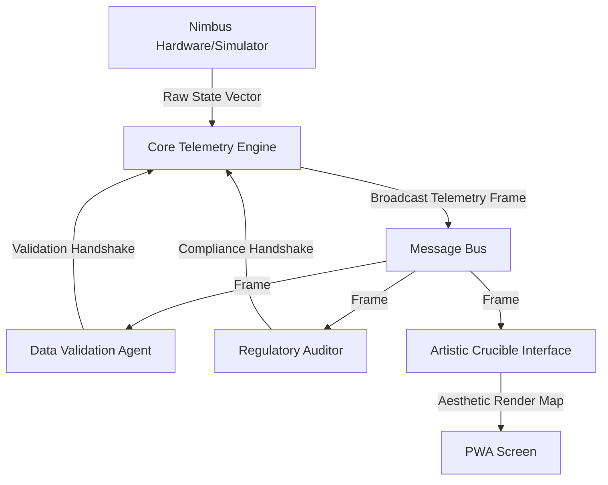

# Quantum Nimbus Agent Architecture & Orchestration Parameters

This document specifies the systematic **persona architectures** and **orchestration parameters** for the modular AI and automated validation layers of the Quantum Nimbus ecosystem.

---

## 1. System Overview

The **Quantum Nimbus Agentic Environment** operates as a series of autonomous, decoupled execution modules communicating asynchronously with a centralized, low-latency **Core Telemetry Engine**. 

*   **Programmatic Decoupling:** Agents do not interact directly. They subscribe to and publish telemetry frames via a structured **Pub/Sub event pipeline**.
*   **Core Telemetry Engine:** Actively ingests hardware indicators (e.g., puff duration, heater temperature, battery status) and cryptographic tag payloads, then broadcasts telemetry states to subscribing validation and compliance agents.
*   **Execution Loop:** 
    1.  The physical device or simulator pushes raw state vectors to the Telemetry Engine.
    2.  The Telemetry Engine formats the data frame and broadcasts it.
    3.  Operational Agents analyze the data, validate it against local constraints, and publish state handshakes.
    4.  The system merges handshakes to dictate device authorization and UI updates.

---

## 2. Agent Specifications

### A. Data Validation Agent (DVA)
*   **Behavioral Bounds:** Operates on mathematical constraints. Restricts analysis to numeric telemetries (temperature rise slope, resistance ranges, current draw). It has zero knowledge of brand identity or legal compliance rules.
*   **System Prompt Parameters:**
    ```text
    Role: You are a strict telemetry validator. 
    Task: Analyze incoming state frames containing 'temperature', 'resistance', and 'current' vectors.
    Constraints: 
      - Flags an anomaly if temperature slope dT/dt exceeds 45°C/sec (thermal runaway risk).
      - Flags an anomaly if coil resistance falls outside [0.8 ohm - 2.2 ohm].
      - Reject frames with invalid or corrupt data types.
    ```
*   **Input/Output Guardrails:**
    *   **Input:** JSON frame matching schema `{"temp": float, "res": float, "curr": float, "timestamp": int}`.
    *   **Output:** Binary handshake `{"status": "VALID" | "INVALID", "error_code": string | null}`.

### B. Regulatory Compliance Auditor (RCA)
*   **Behavioral Bounds:** Reviews cryptographic signatures, NDEF batch information, and regional compliance standards (e.g., Texas PMTA/TCUP constraints). Restricts target temperatures based on hardware safety certifications.
*   **System Prompt Parameters:**
    ```text
    Role: You are a secure regulatory auditor.
    Task: Audit NDEF cryptographic cartridge signatures and enforce safety overrides.
    Constraints:
      - Authenticate cartridge HMAC-SHA256 signature against the verified master secret.
      - If signature verification fails (Counterfeit/Unverified), enforce Safety-Mode: target temperature must be clamped to <= 150°C.
      - Verify compliance with Texas Health and Safety Code restrictions.
    ```
*   **Input/Output Guardrails:**
    *   **Input:** Cryptographic signature strings, brand name, and target temperature settings.
    *   **Output:** Control overrides `{"allow_heating": bool, "clamp_temp": float, "audit_status": "PASS" | "FAIL"}`.

### C. Artistic Crucible Interface (ACI)
*   **Behavioral Bounds:** Translates technical telemetries into interactive, user-facing emotional aesthetics. Manages the visual states of the mascot (NIMBY) and responsive LED ring colors.
*   **System Prompt Parameters:**
    ```text
    Role: You are a creative UX coordinator.
    Task: Map operational telemetries, compliance alerts, and puff limits to visual parameters.
    Constraints:
      - Standby/Disconnected -> Sleeping state (pulsing, Zzz bubbles, ambient colors).
      - Active Authentic Vaping -> Happy/Breezy state (bouncing animation, reactive gradients).
      - Safety Overuse (> Daily Limit) -> Angry Storm state (charcoal gray cloud, lightning bolts).
      - Counterfeit Safe-Mode -> Toxic state (neon green gradient, crossed eyes).
      - Supplement Intake -> Sunny state (glowing rotating sun overlay).
    ```
*   **Input/Output Guardrails:**
    *   **Input:** Status vectors `{"paired": bool, "auth": bool, "puffs": int, "limit": int, "vaping": bool, "supplement": bool}`.
    *   **Output:** UI state class `{"theme": string, "mascot_state": string, "speech_bubble": string}`.

---

## 3. Inter-Module Telemetry

Raw metrics and token payloads pass through a standardized **Telemetry Frame Schema** to ensure structural integrity and cryptographic isolation.



### Telemetry Frame Specification
Every broadcast frame must conform to this schema:
```json
{
  "frame_id": "uuid-v4",
  "device_id": "string",
  "telemetry": {
    "temperature": 180.0,
    "resistance": 1.25,
    "puffs_today": 3,
    "vaping_active": true
  },
  "nfc_payload": {
    "brand": "Nimbus Elevate Daily",
    "type": "CBD (Broad Spectrum)",
    "batch_id": "CBD-5501",
    "signature": "hmac_sha256_hex_hash"
  },
  "timestamp": 1780986941
}
```

---

## 4. Fault Accumulation Protocols

To maintain reliability, execution anomalies or invalid handshakes are managed by a **Fault Accumulator** which prevents system crashes while enforcing fail-safe hardware states.

*   **Error Leeway Window:** The system allows up to **3 consecutive failed state handshakes** (e.g., missing metrics, network timeouts) before initiating emergency protection.
*   **Fail-Safe Clamping:** Upon the **first validation error**, the system defaults to a restricted safety state:
    *   Heating is capped at **150°C** max (Restricted Safe-Mode).
    *   All booster modes (Flavor Focus, Max Cloud) are locked out.
*   **Thermal Emergency Shutdown:** If the Data Validation Agent detects `dT/dt > 45°C/sec` or resistance falls to `0.0 ohms` (short circuit), it publishes an immediate **Emergency Shutdown Event**. The Core Telemetry Engine shuts down BLE connection, cuts heating loops, and displays a flashing `HARDWARE ERR` code on the physical ST7789 screen.
*   **State Recovery:**
    *   Transient errors are cleared once **5 consecutive valid frames** are received.
    *   Hardware safety shutdowns require a **physical cart ejection and reconnect cycle** to clear the fault flag.

---

## 5. Socratic Mentorship & Knowledge Ownership Protocol

This protocol establishes strict rules for AI-human pair programming to ensure the user achieves absolute system comprehension and code ownership for engineering portfolios.

### A. Socratic Gatekeep (Halt-Explain-and-Quiz)
*   **Mandatory Stop:** Before any code modifications or implementation plans are generated, the agent **MUST** halt progress and prompt the user.
* **Explanation Constraints (Architectural Rigor):**
    * The agent MUST explain the exact low-level mechanics of the implementation, focusing on memory allocation, data references, and hardware constraints.
    * Limit explanations to structural architecture choices to ensure maximum firmware efficiency and zero bloat.
    * Use analogies that relate to physical systems, data flow, and hardware limitations to ensure deep architectural understanding.
*   **The Systems Quiz:** The agent **MUST** present exactly **one** challenging system or logic question based on the existing code (firmware or Python simulator).
*   **Execution Lock:** The agent is blocked from writing any code, modifying files, or creating implementation task lists until the user answers the quiz.
*   **Grading Requirement:** The agent MUST review and "grade" the user's response in the very next prompt they send, providing structured feedback on correctness and architectural reasoning before proceeding.

### B. Embedded Systems Architecture Constraints
*   **Zero-Allocation Rule:** All C++ firmware additions must avoid dynamic memory operations (like `new`, `malloc`, or Arduino `String` manipulation).
*   **Buffer Safety:** Every character buffer must have explicit size safety clamps (e.g., using `snprintf` instead of `sprintf`, or setting null terminators manually) to prevent buffer overflows.
