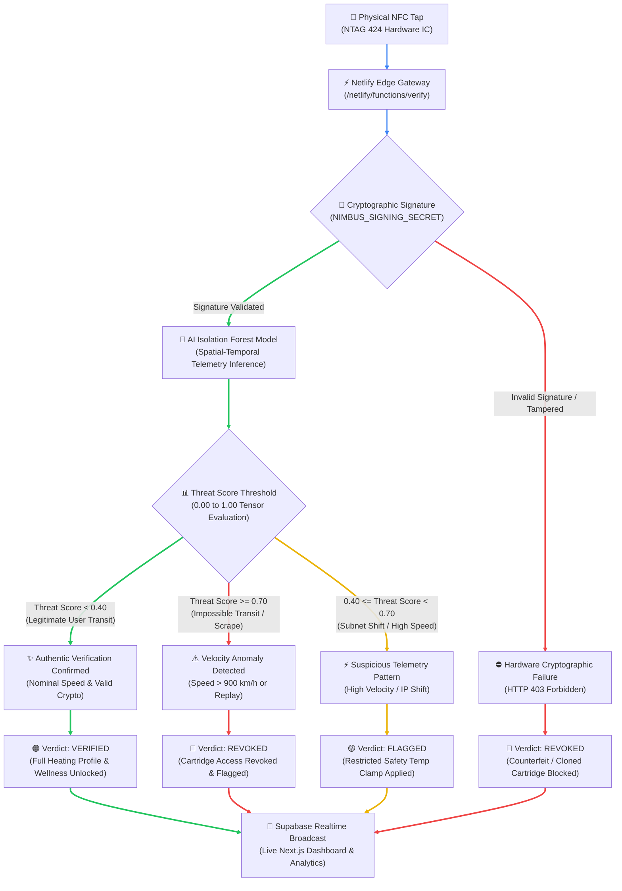

# Quantum Nimbus (QN) 🛡️⚡
> **Hardware-Backed Zero-Trust Authentication & Real-Time Anomaly Detection Engine**

[](https://nextjs.org/)
[](https://fastapi.tiangolo.com/)
[](https://supabase.com/)
[](https://onnxruntime.ai/)
[](https://www.nxp.com/)

---

## 📌 Executive Overview

Traditional product authentication methods—such as static QR codes, serial numbers, and basic NFC tags—are highly vulnerable to copying, cloning, replay attacks, and supply chain diversion. Brand counterfeiting costs global markets hundreds of billions annually, compromising consumer safety and brand integrity.

**Quantum Nimbus (QN)** solves this crisis by combining **NTAG 424 DNA hardware-level AES-128 cryptography** with **cloud-native, sub-50ms machine learning anomaly detection**. Every physical tap generates a dynamic cryptographic token that can never be reused. The QN engine instantly evaluates spatial-temporal telemetry (tap frequency, geographical displacement speed, and IP subnet shifts) using an ONNX-compiled Isolation Forest model. 

Crucially, Quantum Nimbus achieves enterprise-grade zero-trust authentication with a **privacy-first design**, requiring **zero Personally Identifiable Information (PII)**, zero user sign-ups, and zero invasive location tracking.

---

## 🛡️ System Decision Flow

The following decision flowchart maps the physical NFC tap through fail-fast cryptographic validation, AI threat scoring, and real-time dashboard notifications:



---

## 🔑 Core Security & Architectural Pillars

1. **Hardware-Backed Identity (Root of Trust):**  
   Utilizes physical **NXP NTAG 424 DNA** ICs leveraging Secure Unique NFC (SUN) functionality. Each tap generates a fresh, single-use AES-128 cryptographic CMAC payload that prevents static cloning and payload mirroring.
2. **Sub-50ms Edge AI Inference:**  
   Evaluates a four-dimensional feature vector ($\Delta t$ time delta, Haversine distance, calculated transit velocity, and IP subnet delta) using a lightweight **Isolation Forest ML model** compiled to ONNX tensor bytecode for zero-latency execution.
3. **Privacy-First Design (Zero PII):**  
   Protects user anonymity entirely. Authentication requires no user registration, email, or exact device GPS coordinates. Telemetry relies on coarse network geolocation and relative temporal sequences.
4. **Fail-Fast Security Gateway:**  
   Applies immediate cryptographic signature verification at the edge. Invalid or tampered signatures trigger a **fail-fast HTTP 403 Forbidden** before invoking database reads or ML inference pipelines, protecting cloud infrastructure against compute DoS attacks.

---

## 🏗️ Stack Architecture

| Layer | Technology | Purpose |
| :--- | :--- | :--- |
| **Hardware / Edge** | NTAG 424 DNA IC (13.56 MHz RF) | Silicon root of trust issuing dynamic AES-128 SUN tokens |
| **Backend Gateway** | Netlify Serverless / FastAPI | Edge execution handling cryptographic signature checks and API dispatch |
| **Database & Realtime** | Supabase (PostgreSQL) + Postgres CDC | Persistent time-series logging (`telemetry_logs`) & real-time WebSocket events |
| **Inference Engine** | ONNX Runtime (`nimbus_model.onnx`) | Machine learning runtime executing Isolation Forest threat scoring in < 50ms |
| **Frontend Dashboard** | Next.js (App Router), Tailwind CSS, Tremor | Enterprise monitoring console with interactive telemetry gauges & status badges |

---

## 📁 Repository Directory Structure

```ascii
Quantum-Nimbus/
├── docs/                      # Public architectural overview & whitepapers
│   ├── ARCHITECTURE.md        # High-level system design overview
│   └── API_SPEC.md            # Endpoint specifications
├── frontend/                  # Next.js Web Dashboard & Client App
│   ├── app/                   # App Router pages, components, & layouts
│   ├── components/            # Reusable UI badges, gauges, & charts
│   └── public/                # Static brand assets & iconography
├── backend/                   # Netlify Edge Functions & API Gateway
│   ├── functions/             # Verification endpoints (verify.ts)
│   └── lib/                   # Database schemas & cryptographic helpers
├── ml/                        # Machine Learning Model Pipeline
│   ├── train_model.py         # Isolation Forest model training script
│   ├── nimbus_model.onnx      # Compiled ONNX model binary
│   └── schema.json            # Model input/output tensor definitions
└── README.md                  # Project documentation (this file)
```

---

## 🔒 Security & Disclosure

Quantum Nimbus follows strict zero-trust engineering principles. If you discover a potential security vulnerability or cryptanalytic flaw, please report it directly through our security disclosure channel rather than opening a public issue.

* **Security Inquiries:** Email `security@quantumnimbus.io`
* **Technical Due Diligence:** Enterprise partners, auditors, and CTOs may request access to our private repository containing full hardware microcode, detailed sequence diagrams (`HARDWARE_AI_SEQUENCE.md`), and raw model training sets.
